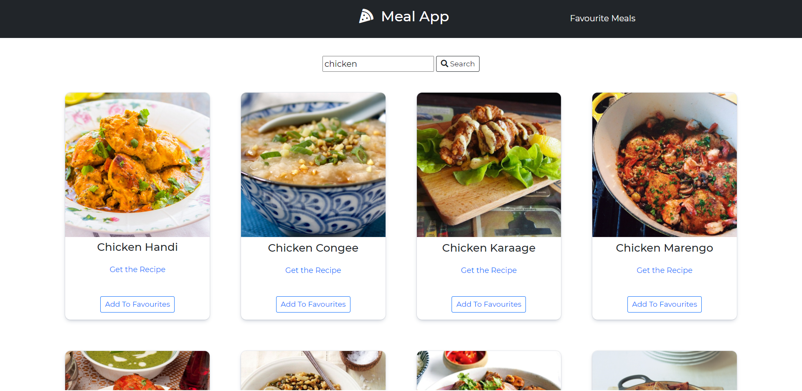
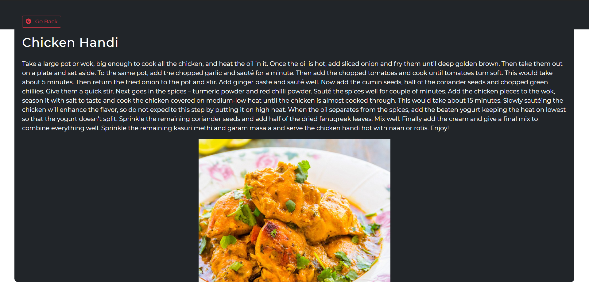
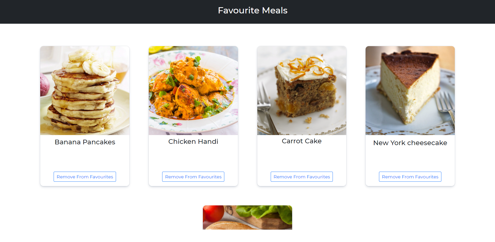

# Meal-app

An app that allows users to search for a meal and get the recipe for that meal.[click here to view the app]

## App Interface

## Features

- Search for any meal
- Get recipe for that particular meal and link to a video
- Add/remove meals from favourites

## API Endpoints

API used for this project: <https://www.themealdb.com/api.php>

API used to fetch meals by name: www.themealdb.com/api/json/v1/1/search.php?s={Name of meal}

API used to fetch meals by their ID: www.themealdb.com/api/json/v1/1/lookup.php?i={meal Id}

## Tech Used

- [HTML](https://en.wikipedia.org/wiki/HTML)
- [CSS](https://en.wikipedia.org/wiki/CSS)
- Vanilla [Javascript](https://www.javascript.com/)
- [Bootstrap](https://getbootstrap.com/)
